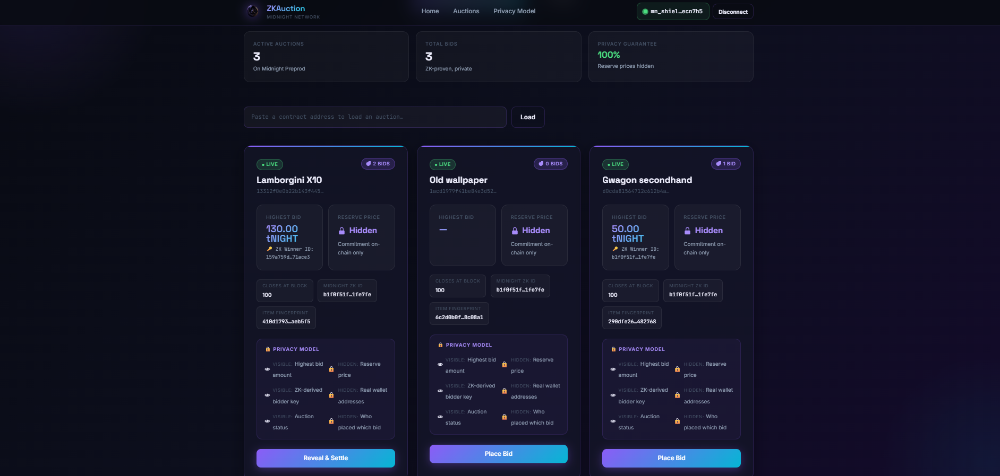
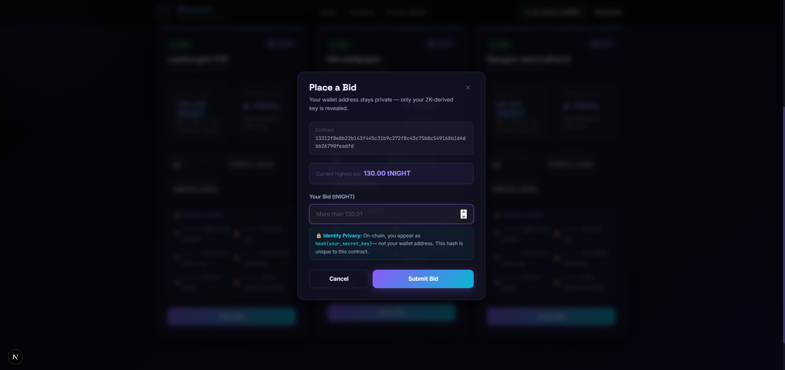
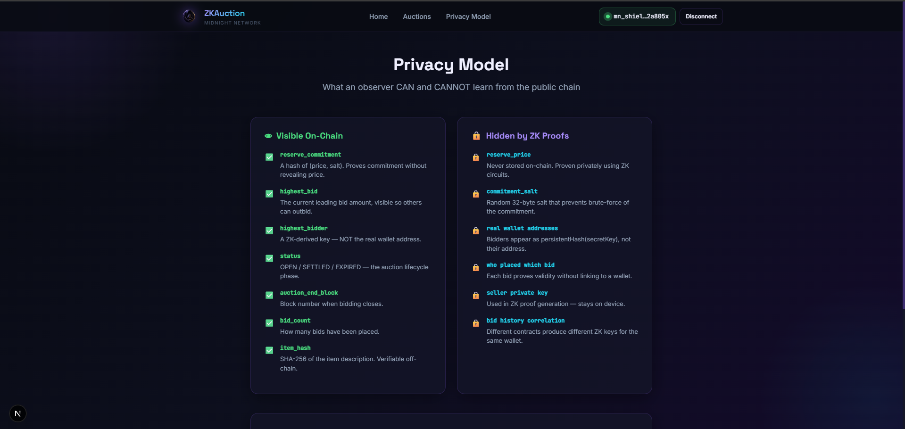
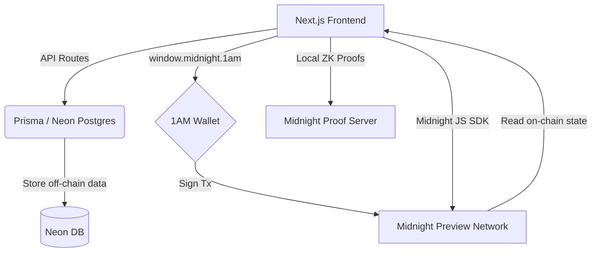
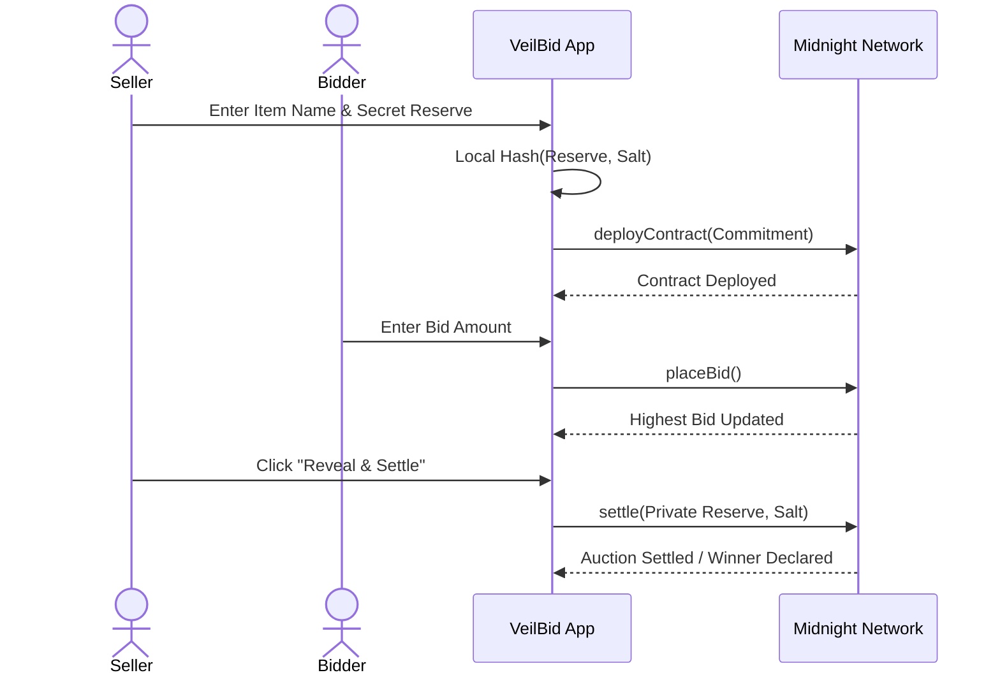

<div align="center">
  
  
  # VeilBid
  **The Next Generation of Private Reserve Auctions on the Midnight Network**
  
  <br />

  [](https://github.com/thisisouvik/VeilBid/actions/workflows/ci.yml)
  
  
  
  
  
  
</div>

---

## 🔗 Quick Links

*   🌐 **Live Deployed App**: [zk-auction-dun.vercel.app](https://zk-auction-dun.vercel.app/)
*   📜 **Deployed Preview Contract**: [`b41e9f3039d...e5352`](https://explorer.1am.xyz/contract/b41e9f3039d8783040b27a6da5353a72c42f863b1878bad594af6e1fc76e5352)
*   🎥 **Demo Video**: [Watch on YouTube](https://youtu.be/SgigJdq82VI)

---

## 💡 The Core Philosophy

### ❌ The Problem with Transparent Blockchains
*   **Exposed Reserve Prices**: Sellers lose their leverage when bidders can see exactly what the minimum acceptable price is.
*   **Strategic Sniping**: Bidders often wait until the last possible block to bid exactly the reserve price, artificially suppressing market value.
*   **Identity Leaks**: Public wallet addresses expose bidder identities, bidding strategies, and total wealth.
*   **MEV Front-running**: Transparent networks allow bots to analyze pending transactions and maliciously outbid real users.

### ✅ The VeilBid Solution
VeilBid solves this by leveraging the **Midnight Network's Zero-Knowledge (ZK)** capabilities to build a truly private auction environment:
*   **Hidden Reserve Prices**: Sellers cryptographically hide their reserve price. Bidders bid blindly without knowing the threshold.
*   **Secure Settlements**: When the auction ends, the ZK smart contract mathematically proves if the highest bid met the hidden reserve—*without ever revealing what the reserve was*.
*   **Shielded Identities**: Bidder identities are kept strictly private and entirely decoupled from their real wallet addresses.

---

## 🔒 Privacy Model Breakdown

VeilBid utilizes Midnight's hybrid state model to protect users. Here is exactly what data is visible vs. hidden:

### 👁️ Visible On-chain (Public)
*   🟢 `reserve_commitment`: A cryptographic hash (not the actual price).
*   🟢 `highest_bid`: The current leading bid amount.
*   🟢 `highest_bidder`: A randomly derived ZK identity key.
*   🟢 `status`: Auction state (`OPEN`, `SETTLED`, `EXPIRED`).
*   🟢 `bid_count`: Total network participation.

### 🛡️ Strictly Hidden (Zero-Knowledge)
*   🔴 **The Actual Reserve Price**: Encrypted on the seller's local device.
*   🔴 **The Private Salt**: Used to lock the commitment; never broadcasted.
*   🔴 **Real Wallet Addresses**: Hidden behind ZK proofs to prevent identity tracking.
*   🔴 **Bid History Linkage**: Impossible to trace who placed which bid.

---

## 📸 Platform Showcase

<div align="center">
  <table>
    <tr>
      <td align="center"><b>1. Landing Page</b><br><br><i>Fully responsive, glassmorphism UI</i></td>
      <td align="center"><b>2. Syncing State</b><br><br><i>Sleek loading overlays during chain sync</i></td>
    </tr>
    <tr>
      <td align="center"><b>3. Live Auctions</b><br><br><i>Dashboard displaying ZK-protected states</i></td>
      <td align="center"><b>4. Creating an Auction</b><br><br><i>Enter a secret reserve price</i></td>
    </tr>
    <tr>
      <td align="center"><b>5. Placing a Bid</b><br><br><i>Securely bid without seeing the reserve</i></td>
      <td align="center"><b>6. Privacy Breakdown</b><br><br><i>Transparent privacy model explanation</i></td>
    </tr>
  </table>
</div>

---

## 📜 Zero-Knowledge Smart Contracts

The VeilBid smart contract is written entirely in **Compact** (Midnight's specialized ZK DSL). 

### The 4 Core ZK Circuits:
1.  **`createAuction`**: The seller hashes their `reserve_price` + `salt` locally. Only the resulting `reserve_commitment` is sent to the blockchain.
2.  **`placeBid`**: Verifies the new bid is higher than the current `highest_bid` without exposing the bidder's real address.
3.  **`settle`**: The seller proves that `hash(secret_price, salt) == reserve_commitment`, and the contract evaluates if the highest bid won.
4.  **`withdrawExpired`**: Allows participants to safely reclaim locked funds if the reserve wasn't met.

### On-Chain Verifications

| Action | Transaction Hash | Explorer Link |
| :--- | :--- | :--- |
| **Contract Deployment** | `2806e44f...acff` | [View Tx](https://explorer.1am.xyz/tx/2806e44f123c3a1066b644bad3d8f04930f69bc2107aec000e68c1fac645acff?network=preview) |
| **Create Auction** | `dd318ad7...15d0` | [View Tx](https://explorer.1am.xyz/tx/dd318ad7ddfe8e4fb1cff7cce05ce25ed093a4f585c163b9aca4e3013cd415d0?network=preview) |
| **Place Bid** | `2806e44f...acff` | [View Tx](https://explorer.1am.xyz/tx/2806e44f123c3a1066b644bad3d8f04930f69bc2107aec000e68c1fac645acff?network=preview) |

> *Images of the Compact Circuit code and Block Explorer receipts are available in the `/assets/SMART CONTRACTS/` directory.*

---

## 🏗 Architecture & Workflow

### Technical Architecture


### Protocol Workflow


---

## 📁 Repository Structure

```text
VeilBid/
├── app/                    # Next.js App Router (Frontend UI)
├── components/             # Reusable React components
├── contract/
│   └── src/
│       ├── auction.compact # Core Midnight ZK Smart Contract
│       └── auction.test.ts # Smart Contract automated tests
├── hooks/                  # Custom React hooks (Wallet context)
├── lib/                    # Midnight SDK API integration & Providers
├── prisma/                 # Neon Postgres Database Schema
└── public/                 # Static assets and ZK compiled keys
```

---

## ✅ Security & Testing

The VeilBid smart contract is rigorously tested using Vitest inside the Midnight testing environment to guarantee zero-knowledge constraints hold true under edge cases.

*   **Total Test Cases**: 15 exhaustive ZK logic tests.
*   **Result**: `PASS` (See `assets/TEST/test screenshot.png`)

To run them yourself:
```bash
npm install
npm test
```

---

## 📚 Project Documentation

The complete documentation for VeilBid has been modularized for easy reading. Check out the following files:

*   📖 **[SETUP.md](./SETUP.md)**: A complete guide on installing the 1AM Wallet, acquiring testnet tokens, and running the project locally.
*   📖 **[USAGE.md](./USAGE.md)**: Step-by-step instructions for creating auctions, placing bids, and settling smart contracts.
*   📖 **[PROPOSAL.md](./PROPOSAL.md)**: Detailed technical specifications, original problem statements, and the builder proposal.

---

## 🚀 The Future of VeilBid

**Planned Enhancements:**
*   **Dynamic Auto-Bidding**: Set maximum limits without revealing your ceiling to the network.
*   **Native ZK-NFTs**: Seamlessly and privately transfer Midnight NFTs to the winner upon auction settlement.

**Real-World Use Cases:**
*   🎨 **High-Value Art**: Wealthy buyers demand anonymity. Sellers need hidden minimums to spark bidding wars.
*   🏢 **Corporate Procurements**: Government or B2B sealed-bid contracts where pricing must remain absolutely secret until final evaluation.
*   📉 **DeFi Liquidations**: Private collateral liquidation to avoid market panic and front-running bots.

---

<div align="center">
  <b>Done in Midnight! 🌙</b><br>
  <i>Built with ❤️ by the Midnight Builder Community.</i>
</div>
